# RECONCILIACÃO FINANCEIRA DETALHADA DO DRY RUN

**Sistema:** LEMOKA CENTRO AUTOMOTIVO  
**Data:** 09/09/2026  

---

## 1. Totais Financeiros Auditados na Fonte vs Simulação

```mermaid
gantt
    title Reconciliação Matemática de Valores Monetários (R$)
    dateFormat X
    axisFormat %s

    section Contas a Receber
    Valor Bruto Fonte OSDIG : 0, 1722308
    Valor Líquido Fonte OSDIG : 0, 1722308
    Simulado no Dry Run : 0, 1722308

    section Contas a Pagar
    Valor Líquido Fonte OSDIG : 0, 3319
    Simulado no Dry Run : 0, 3319
```

| Módulo Financeiro | Valor na Fonte OSDIG (R$) | Valor Simulado no Dry Run (R$) | Diferença (R$) | Status de Precisão |
| :--- | :---: | :---: | :---: | :---: |
| **Contas a Receber (Valor Bruto)** | R$ 1.722.308,52 | R$ 1.722.308,52 | R$ 0,00 | 100.00% EXACT |
| **Contas a Receber (Valor Líquido)** | R$ 1.722.308,52 | R$ 1.722.308,52 | R$ 0,00 | 100.00% EXACT |
| **Contas a Receber (Valor Pago Registrado)** | R$ 0,00 | R$ 0,00 | R$ 0,00 | 100.00% EXACT |
| **Contas a Receber (Saldo em Aberto)** | R$ 1.722.308,52 | R$ 1.722.308,52 | R$ 0,00 | 100.00% EXACT |
| **Contas a Pagar (Valor Líquido)** | R$ 3.319,47 | R$ 3.319,47 | R$ 0,00 | 100.00% EXACT |
| **Contas a Pagar (Valor Quitado)** | R$ 3.319,47 | R$ 3.319,47 | R$ 0,00 | 100.00% EXACT |
| **OS / Vendas (Soma Acumulada das OSs)** | R$ 49.034.766,00 | R$ 49.034.766,00 | R$ 0,00 | 100.00% EXACT |

---

## 2. Diagnóstico de Recebíveis no Dashboard

- **Total de Recebíveis Históricos:** R$ 1.722.308,52.
- **Classificação Temporária de Vencimento:** A classificação de títulos em atraso utilizará estritamente a data de vencimento de cada título em relação à data atual do servidor no momento do Go-Live.
- **Isenção de Duplicidade no Faturamento:** Garantido que transferências de contas ou títulos de compras não inflarão a DRE nem duplicarão receitas no Caixa.
