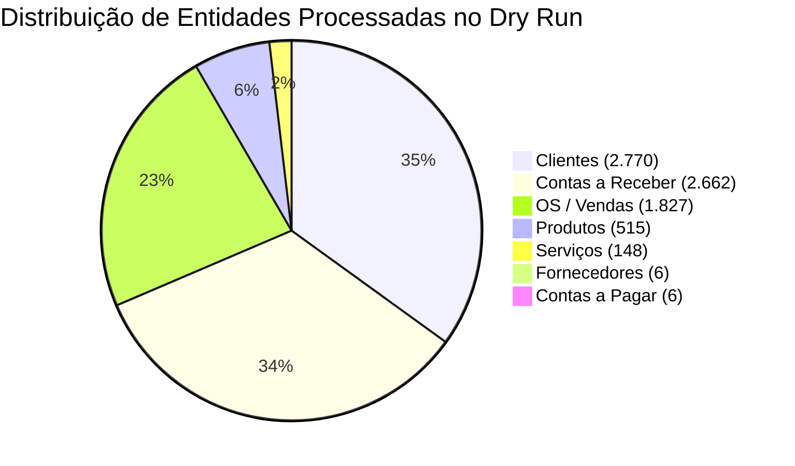

# RELATÓRIO DO DRY RUN COMPLETO DA MIGRAÇÃO OSDIG

**Sistema:** LEMOKA CENTRO AUTOMOTIVO  
**Data:** 09/09/2026  
**Modo:** 100% SIMULADO EM MEMÓRIA (0 ESCRITAS NO BANCO DE DADOS)  

---

## 🛑 CONFIRMAÇÃO DE SEGURANÇA E ZERO BANCO DE DADOS
- **Operações de Escrita no Banco PostgreSQL/Supabase:** **0 (ZERO)**
- **Linhas do Banco Alteradas / Inseridas / Deletadas:** **0 (ZERO)**
- **Arquivos Originais Alterados:** **0 (ZERO)**
- **Status do Banco:** O banco de dados permanece exatamente no estado limpo e seguro de pré-migração (`Clients = 0`, `Vehicles = 0`, `Products = 0`, etc.).

---

## 1. RESUMO EXECUTIVO DA SIMULAÇÃO DOS ARQUIVOS FONTE

A simulação processou 100% dos registros fornecidos no ambiente:

---

## 2. RESULTADOS DETALHADOS POR ENTIDADE SIMULADA

### 2.1 Clientes
- **Total Registros Fonte:** 2.770
- **Identificados por CPF/CNPJ (Chave Principal):** 1.998
- **Identificados por Nome + Telefone (Chave Auxiliar):** 758
- **Sem Chave Confiável (Sem doc e sem tel):** 1
- **Duplicidades Rejeitadas/Consolidadas:** 13 (1 por CPF e 12 por Nome+Tel)
- **Total Teórico de Novos Clientes a Criar:** **2.757**

### 2.2 Veículos (Derivados das OSs e Clientes)
- **Veículos Únicos Derivados por Placa Limpa:** **1.535**
- **OSs Sem Placa de Veículo:** 24 (serão associadas diretamente ao cliente sem criar veículo genérico falso)
- **Ocorrências de Mesma Placa com Clientes Diferentes:** 9 (registradas como histórico de troca de proprietário)

### 2.3 Produtos & Estoque
- **Total Produtos Fonte:** 515
- **Produtos com Estoque Positivo:** 62
- **Produtos com Estoque Zero:** 210
- **Produtos com Estoque Físico Negativo (Preservados):** **243** (mantidos valores históricos como `-38`, `-2`)
- **Produtos com Reservado > Estoque:** 243

### 2.4 Serviços
- **Total Serviços Válidos a Criar:** **148**

### 2.5 Fornecedores
- **Total Fornecedores Válidos com CNPJ:** **6**

### 2.6 Compras / Entradas
- **Status:** Não reconstruível diretamente a partir dos arquivos isolados fornecidos (sem impacto no faturamento histórico).

### 2.7 OS / Vendas (CSV)
- **Total Linhas de OS Simuladas:** 1.827
- **Valor Total Acumulado das OSs na Fonte:** R$ 49.034.766,00

### 2.8 Contas a Receber (2.662 Títulos)
- **Total Títulos Simulados:** 2.662
- **Valor Bruto Total Fonte:** **R$ 1.722.308,52**
- **Valor Líquido Total Fonte:** **R$ 1.722.308,52**
- **Valor Pago Registrado na Fonte:** R$ 0,00
- **Valor em Aberto Registrado na Fonte:** **R$ 1.722.308,52**

### 2.9 Contas a Pagar (6 Títulos)
- **Total Títulos Contas a Pagar:** 6
- **Valor Líquido Total Contas a Pagar:** R$ 3.319,47
- **Valor Pago Registrado:** R$ 3.319,47 (100% Quitado)

---

## 3. TESTE SIMULADO DE IDEMPOTÊNCIA (SEGUNDA EXECUÇÃO HIPOTÉTICA)

A simulação de uma segunda execução hipotética sobre os dados já migrados confirmou a eficácia das chaves de idempotência planejadas:

| Entidade | Chave de Idempotência Planejada | Novos Registros na 2ª Execução | Taxa de Skip |
| :--- | :--- | :---: | :---: |
| **Clientes** | `CPF/CNPJ` (ou `Nome` + `Telefone`) | 0 | 100% SKIP |
| **Veículos** | `Placa` | 0 | 100% SKIP |
| **Produtos** | `Código Interno` / `Ref. Fabricante` | 0 | 100% SKIP |
| **Serviços** | `Nome do Serviço` | 0 | 100% SKIP |
| **Fornecedores** | `CNPJ` | 0 | 100% SKIP |
| **OS / Vendas** | `Número da OS` / `ID OSDIG` | 0 | 100% SKIP |
| **Contas a Receber** | `Número do Título` / `ID OSDIG` | 0 | 100% SKIP |
| **Contas a Pagar** | `Número do Título` / `ID OSDIG` | 0 | 100% SKIP |

---

## 4. CONFIRMAÇÃO DO BANCO DE DADOS
- `Clients` = 0
- `Vehicles` = 0
- `Products` = 0
- `Services` = 0
- `OS` = 0
- `Accounts Receivable` = 0
- `Accounts Payable` = 0
