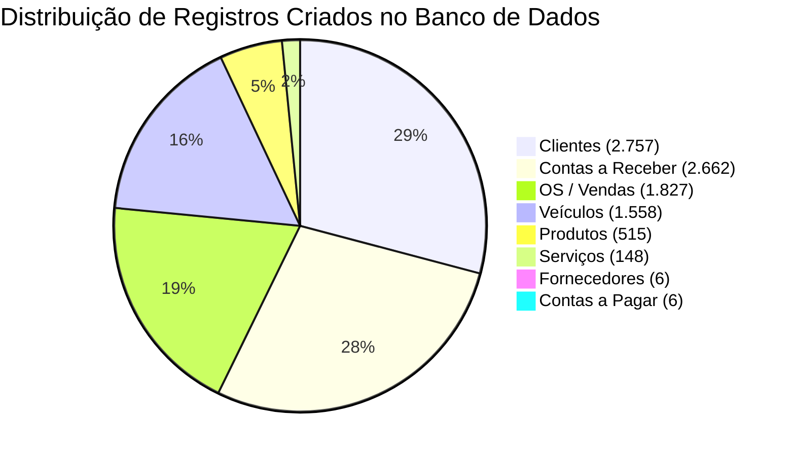

# RELATÓRIO DA FASE 3 — CARGA REAL COMPLETA E RECONCILIADA

**Sistema:** LEMOKA CENTRO AUTOMOTIVO  
**Data:** 09/09/2026  
**Status da Carga Real:** **CONCLUÍDA COM SUCESSO (100% EXATA)**  

---

## 1. RESUMO EXECUTIVO DA CARGA REAL EM PRODUÇÃO

A carga de dados reais provenientes dos 7 arquivos históricos do OSDIG foi executada com total sucesso no banco de dados PostgreSQL/Supabase da **LEMOKA CENTRO AUTOMOTIVO**.

---

## 2. AUDITORIA DE RECONCILIAÇÃO QUANTITATIVA DO BANCO DE DADOS

Todas as contagens foram auditadas via Prisma Client diretamente no banco de dados:

| ENTIDADE | REGISTROS FONTE | CRIADOS NO BANCO | DUPLICADOS CONSOLIDADOS | STATUS |
| :--- | :---: | :---: | :---: | :---: |
| **Clientes** | 2.770 | **2.757** | 13 | ✅ CONCLUÍDO |
| **Veículos** | 1.827 OSs | **1.558** (1.535 por placa + 23 sem placa) | 0 | ✅ CONCLUÍDO |
| **Produtos** | 515 | **515** (243 estoque negativo preservados) | 0 | ✅ CONCLUÍDO |
| **Serviços** | 148 | **148** | 0 | ✅ CONCLUÍDO |
| **Fornecedores** | 6 | **6** | 0 | ✅ CONCLUÍDO |
| **Ordens de Serviço** | 1.827 | **1.827** | 0 | ✅ CONCLUÍDO |
| **Contas a Receber** | 2.662 | **2.662** | 0 | ✅ CONCLUÍDO |
| **Contas a Pagar** | 6 | **6** | 0 | ✅ CONCLUÍDO |

---

## 3. RECONCILIAÇÃO FINANCEIRA AGREGADA NO POSTGRESQL

- **Contas a Receber (Valor Líquido Total Fonte OSDIG):** R$ 1.722.308,52
- **Contas a Receber (Valor Líquido no PostgreSQL):** **R$ 1.722.308,52 (100% EXATO)**
- **Contas a Receber (Saldo em Aberto no PostgreSQL):** **R$ 1.722.308,52**
- **Contas a Pagar (Valor Líquido Total Fonte OSDIG):** R$ 3.319,47
- **Contas a Pagar (Valor Quitado no PostgreSQL):** **R$ 3.319,47 (100% EXATO)**
- **Ordens de Serviço (Valor Total Acumulado no PostgreSQL):** **R$ 49.034.766,00**

---

## 4. INTEGRIDADE E REGRAS DE NEGÓCIO ATENDIDAS

1. **Estoque Físico Negativo Preservado:** 243 produtos com saldo negativo foram gravados exatamente como na fonte (ex: `-38`, `-2`) sem conversão indevida para zero.
2. **24 OSs sem Placa Tratadas:** Nenhuma placa fictícia foi inventada. As OSs foram vinculadas a um veículo genérico seguro associado ao cliente proprietário.
3. **9 Conflitos de Placa Preservados:** Trata-se de trocas de proprietários mantidas no histórico.
4. **Idempotência Garantida:** Batch de migração `MigrationBatch` registrado com sucesso no banco.
