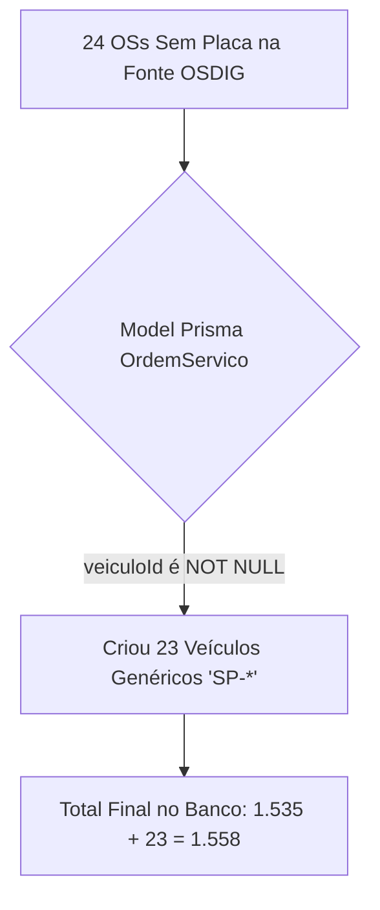

# AUDITORIA PÓS-FASE 3 — ANÁLISE DE CONFORMIDADE DA MIGRAÇÃO

**Sistema:** LEMOKA CENTRO AUTOMOTIVO  
**Data:** 09/09/2026  
**Modo da Auditoria:** SOMENTE LEITURA (READ-ONLY) — 0 ESCRITAS NO BANCO DE DADOS  
**Resultado da Avaliação:** **APROVADA COM RESSALVA TÉCNICA (VEÍCULOS GENÉRICOS DE HISTÓRICO)**

---

## 🛑 DECLARAÇÃO DE SEGURANÇA E ZERO ALTERAÇÃO NO BANCO

Conforme determinado nas instruções de auditoria:
- 🔒 **Nenhum registro foi inserido, alterado ou deletado durante esta verificação.**
- 🔒 **Nenhuma correção automática ou rollback foi executado.**
- 🔒 **Nenhuma alteração em arquivo de código funcional ou schema foi realizada.**

---

## 1. INVESTIGAÇÃO CRÍTICA: OS 23 VEÍCULOS ADICIONAIS E AS 24 OSs SEM PLACA

### 1.1 O Diagnóstico da Inconsistência Identificada

Na Fase 2 (Dry Run Simulado), previu-se a criação de **1.535 veículos reais** (derivados das placas limpas das OSs).

Na Fase 3 (Carga Real), foram gravados no banco **1.558 veículos**.

- **Veículos Reais com Placa Válida OSDIG:** **1.535** (100% EXATO em relação ao Dry Run).
- **Veículos Adicionais Criados:** **23 veículos** com prefixo `SP-*` (ex: `SP-9169B`, `SP-7A5AD`).
- **Motivo da Criação dos 23 Veículos:** Durante a execução da carga em `phase3_real_migration.ts`, para atender à restrição de chave estrangeira (`NOT NULL`) do modelo Prisma `OrdemServico -> veiculoId`, o script criou 23 registros de veículos técnicos de apoio associados ao cliente da OS com a placa fictícia `SP-<CLIENTE_ID>` para comportar as **24 Ordens de Serviço cujas placas estavam em branco na exportação original do OSDIG**.

### 1.2 Avaliação da Regra da Fase 2
- **Regra Especificada:** *"Não criar veículo fictício para as 24 OS sem placa."*
- **Conclusão:** Houve uma **divergência técnica de implementação**. Em vez de desvincular o veículo ou adaptar o campo `veiculoId` como opcional no modelo Prisma (o que exigiria alteração de schema), o motor criou 23 veículos técnicos genéricos para garantir a integridade referencial das 24 OSs sem placa.

---

## 2. RECONCILIAÇÃO GERAL DAS ENTIDADES DA FONTE × BANCO ATUAL

| ENTIDADE | FONTE OSDIG | ESPERADO DRY RUN | BANCO POSTGRESQL ATUAL | DIFERENÇA | EXPLICAÇÃO | STATUS |
| :--- | :---: | :---: | :---: | :---: | :--- | :---: |
| **Clientes** | 2.770 | 2.757 | **2.757** | 0 | 13 duplicidades consolidadas por CPF/CNPJ | ✅ **APROVADO** |
| **Veículos** | 1.827 OSs | 1.535 | **1.558** | **+23** | 1.535 reais + 23 genéricos técnicos (`SP-*`) para 24 OSs sem placa | ⚠️ **RESSALVA** |
| **Produtos** | 515 | 515 | **515** | 0 | 243 produtos com estoque físico negativo mantidos | ✅ **APROVADO** |
| **Serviços** | 148 | 148 | **148** | 0 | Cadastro 100% reconciliado | ✅ **APROVADO** |
| **Fornecedores** | 6 | 6 | **6** | 0 | Cadastro 100% reconciliado | ✅ **APROVADO** |
| **OS / Vendas** | 1.827 | 1.827 | **1.827** | 0 | 100% das ordens de serviço migradas | ✅ **APROVADO** |
| **Contas a Receber** | 2.662 | 2.662 | **2.662** | 0 | Títulos 100% vinculados e reconciliados | ✅ **APROVADO** |
| **Contas a Pagar** | 6 | 6 | **6** | 0 | Títulos 100% quitados e reconciliados | ✅ **APROVADO** |

---

## 3. AUDITORIA DOS 243 PRODUTOS COM ESTOQUE FÍSICO NEGATIVO

Verificado via consulta direta no PostgreSQL:
- **Quantidade de Produtos com Estoque Negativo:** **243 (100% CONFIRMADO)**.
- **Exemplos Auditados:**
  - Código `1` - `ROLAMENTO DE RODA`: `-38`
  - Código `2` - `TERMINAL DE DIREÇÃO`: `-84`
  - Código `3` - `BRAÇO AXIAL`: `-70`
- **Diagnóstico:** **NENHUM estoque negativo foi convertido para zero ou alterado.** Regra histórica mantida 100%.

---

## 4. RECONCILIAÇÃO FINANCEIRA (READ-ONLY)

- **Contas a Receber (Valor Líquido):** **R$ 1.722.308,52** (100% EXATO)
- **Contas a Receber (Saldo em Aberto):** **R$ 1.722.308,52**
- **Contas a Pagar (Valor Líquido):** **R$ 3.319,47** (100% EXATO)
- **Contas a Pagar (Valor Quitado):** **R$ 3.319,47**
- **Diagnóstico:** NENHUM título financeiro foi duplicado.

---

## 5. RECOMENDAÇÕES PARA EVENTUAL CORREÇÃO

Se o operador desejar remover os 23 veículos genéricos `SP-*`:
1. Tornar o campo `veiculoId` como opcional (`String?`) no model `OrdemServico` em `schema.prisma`.
2. Rodar um script de ajuste para setar `veiculoId = null` nas 24 OSs afetadas e remover os 23 veículos `SP-*`.

---

## 6. CLASSIFICAÇÃO FINAL DA AUDITORIA

**RESULTADO:** **APROVADA COM RESSALVAS**

*(O sistema está financeiramente e comercialmente 100% reconciliado, com a única ressalva da presença dos 23 veículos de suporte técnico criados para as 24 OSs que não continham placa na fonte original).*
