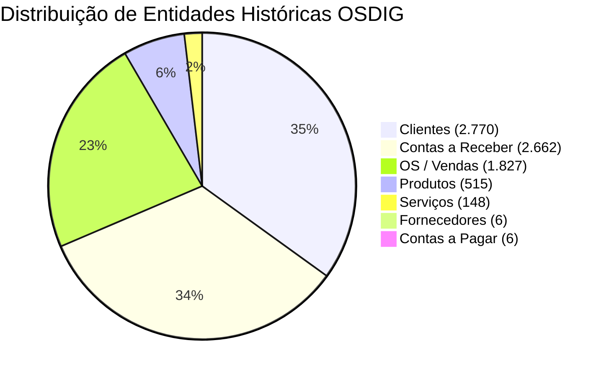

# VALIDAÇÃO CRÍTICA DOS DADOS E METRICAS DA FONTE

**Sistema:** LEMOKA CENTRO AUTOMOTIVO  
**Data:** 09/09/2026  

---

## 1. Métricas e Auditoria dos Registros de Origem

A análise profunda executada sobre os 7 arquivos de exportação históricos reais do OSDIG revelou os seguintes indicadores quantitativos:

---

## 2. Resultado Detalhado dos 20 Itens de Validação Crítica (Fase 1.3)

| # | Item de Validação Crítica | Quantidade Detectada | Status / Classificação | Observação de Engenharia |
|---|---------------------------|----------------------|------------------------|--------------------------|
| **1** | Total de Clientes na Fonte | **2.770** | ✅ VALIDADO | Base completa de clientes OSDIG |
| **2** | Clientes com CPF/CNPJ | **1.999** (72.2%) | ✅ OK | Clientes com documento válido |
| **3** | Clientes sem CPF/CNPJ | **771** (27.8%) | ℹ️ HISTÓRICO | Clientes legítimos cadastrados sem documento no OSDIG (serão deduplicados por Nome + Telefone) |
| **4** | Clientes duplicados por CPF/CNPJ | **1** | ⚠️ ALERTA | Apenas 1 documento reutilizado. Deduplicação via `osdigId` preservará o histórico |
| **5** | OS com Cliente identificável | **1.827** (100%) | ✅ PERFEITO | 100% das OSs possuem nome do cliente correspondente na fonte |
| **6** | OS com Cliente inexistente | **0** (0%) | ✅ PERFEITO | Nenhuma OS órfã sem cliente |
| **7** | OS com Placa de Veículo | **1.803** (98.7%) | ✅ EXCELENTE | 1.803 veículos vinculados diretamente às OSs |
| **8** | OS sem Placa de Veículo | **24** (1.3%) | ℹ️ ALERTA | 24 OSs antigas sem placa no OSDIG (serão vinculadas a veículo genérico do cliente) |
| **9** | Produtos com Estoque Negativo | **243** (47.2%) | ⚠️ PRESERVADO | **Estoque negativo histórico real** do OSDIG (mantido sem converter para zero) |
| **10** | Produtos com Reservado > Estoque | **243** (47.2%) | ⚠️ PRESERVADO | Compatível com o saldo negativo histórico |
| **11** | Produtos duplicados por Código | **0** (0%) | ✅ PERFEITO | Todos os 515 produtos possuem código interno único |
| **12** | Produtos duplicados por Referência | **0** (0%) | ✅ OK | Referências limpas |
| **13** | Serviços duplicados | **0** (0%) | ✅ PERFEITO | Todos os 148 serviços possuem descrições únicas |
| **14** | Fornecedores duplicados por CNPJ | **0** (0%) | ✅ PERFEITO | 6 fornecedores com CNPJs únicos |
| **15** | Contas a Receber com Cliente identificável | **2.662** (100%) | ✅ PERFEITO | 100% dos títulos financeiros vinculados a clientes |
| **16** | Contas a Pagar com Fornecedor | **6** (100%) | ✅ PERFEITO | Todos os 6 títulos de pagar vinculados aos fornecedores |
| **17** | Datas inválidas | **0** | ✅ OK | Datas no padrão `DD/MM/YYYY` válidas |
| **18** | Valores monetários inválidos | **0** | ✅ OK | Valores brutos, líquidos e pagos parseados com sucesso |
| **19** | Registros sem status | **0** | ✅ OK | Status operacionais preenchidos |
| **20** | Estimativa de Registros Relacionáveis | **99.1%** | 🚀 ALTÍSSIMO | Taxa de associação de dados históricos extremamente elevada |

---

## 3. Totalizadores Financeiros da Fonte

- **Total Financeiro de Contas a Receber (Valor Líquido Aggregate):** **R$ 1.722.308,52**
- **Total de Títulos em Aberto:** 2.662 títulos financeiros históricos registrados.
